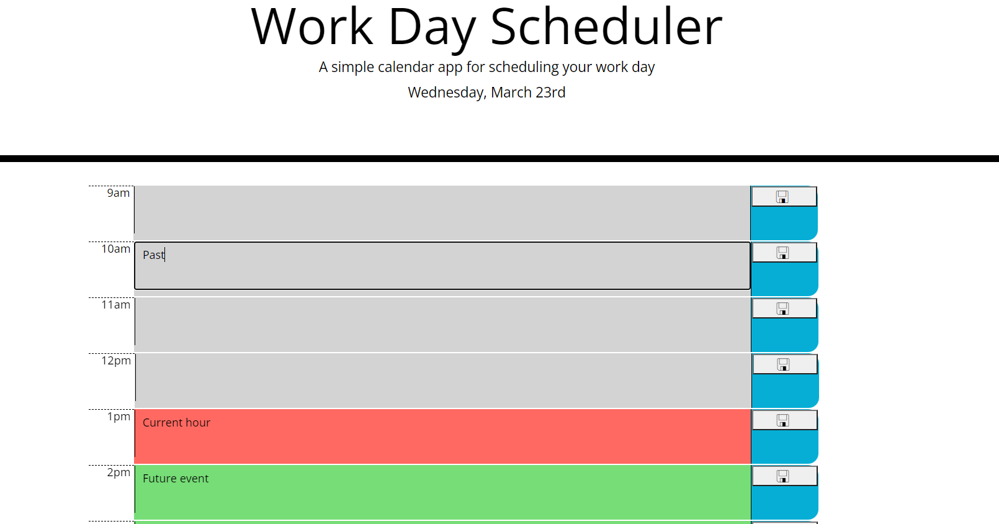

# HW05-ThirdPartyAPIs-WorkDayScheduler

Third Party APIs: Work Day Scheduler

This is a webpage that allows you to use a daily planner. The html page is modified using JavaScript by using the DOM. Text entered into each hour is saved manually when clicking the save button. After saving everything you need, you can refresh the page and the inputs you saved are still visible. Any new saves after refreshing will overwrite your previous saves so you must save every entry you need.

The webpage makes use of moment.js to keep track of the date and time, each hour is colour coded depending on the current time.

Link to deployed application: [https://r134x7.github.io/HW05-ThirdPartyAPIs-WorkDayScheduler/](https://r134x7.github.io/HW05-ThirdPartyAPIs-WorkDayScheduler/)

This is only a screenshot: 
